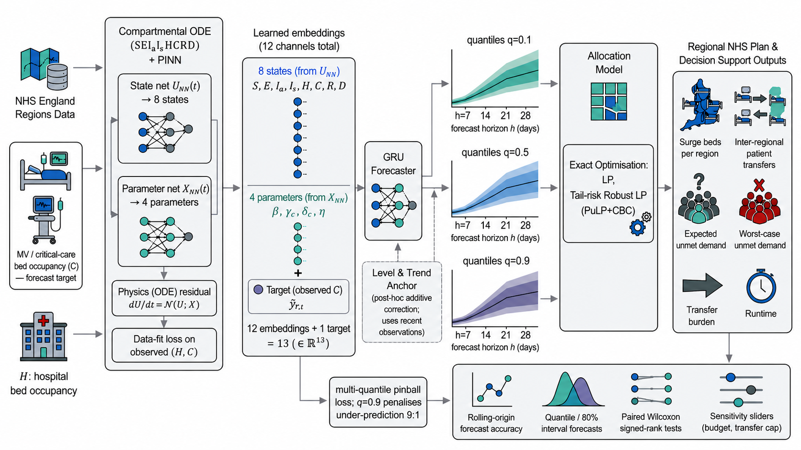
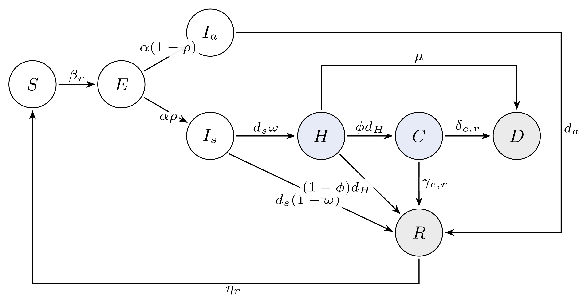
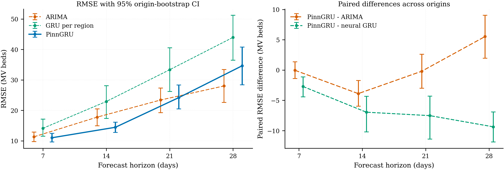
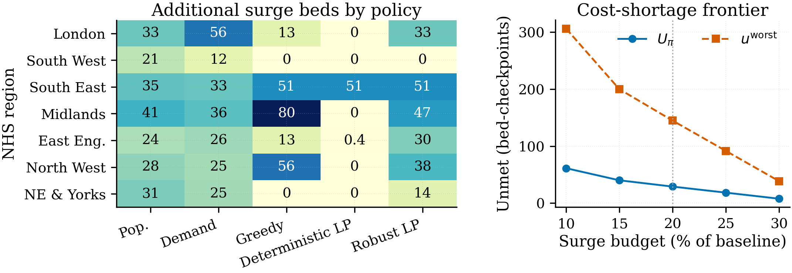
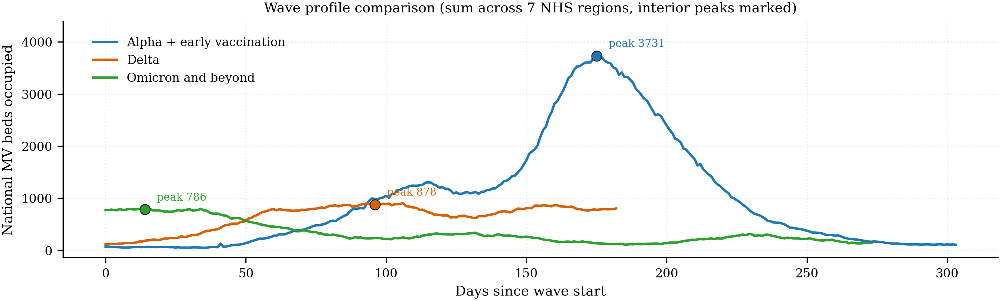
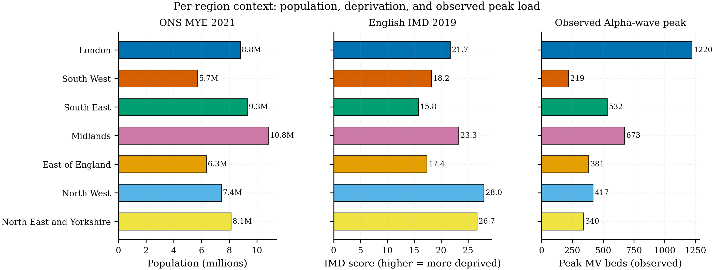

<!-- _class: lead -->
<!-- _paginate: false -->

# Physics-Informed ICU Bed Forecasting with Cost-Asymmetric Quantile Loss and Robust Optimisation

For NHS Critical-Care Surge Capacity Under Demand Uncertainty

<strong>Michael Ajao-Olarinoye</strong> · Abiola Babatunde · Vasile Palade

Centre for Computational Sciences and Mathematical Modelling, Coventry University

UKCI 2026 · Coventry · 9–11 September 2026

---

# The Problem: Planning Surge Capacity Before Demand Is Known

During an epidemic wave, NHS planners must **pre-position critical-care beds** and **route patients** across the **seven NHS England regions** — committing *before* demand is observed.

- **Regime shift:** Delta → Omicron changed the case-to-hospitalisation ratio, breaking stationary models
- **Operating limits:** finite surge budget (≈20% of baseline) and travel-time-capped mutual aid (≤240 min)

> **The error cost is asymmetric.** Under-prediction strands patients (high cost); over-prediction only wastes prepared capacity (low cost). Standard forecasters optimise *symmetric* accuracy.

---

# Contributions

1. **Cost-asymmetric forecaster** — a multi-quantile pinball loss (the $q^{0.9}$ branch penalises under-prediction **9-to-1**) plus a learnable level-and-trend anchor. Cuts 14-day RMSE **19%** vs refitted ARIMA, **37%** vs a per-region GRU.

2. **Robust LP allocation** — a hybrid-regional tail-risk linear program that attains the **lowest transfer burden** ($4.6\times$ below population-proportional) among budget-exhausting policies.

3. **$SEI_aI_sHCRD$ clinical split** — separates hospitalisation $\omega$ ($I_s\!\to\!H$) from critical-care escalation $\phi$ ($H\!\to\!C$), fixing the overloaded $\omega$ of prior work.

> **Gap closed:** no prior work combines physics-informed *regional* NHS ICU forecasting with cost-asymmetric quantile training and an *exact robust LP* across all seven regions.

---

# A Forecast-to-Decision Pipeline

**A** Per-region PINN-SEIRD forecaster, cost-asymmetric pinball loss → **B** discretise quantiles into low/median/high scenarios $\pi=(0.2,0.6,0.2)$ → **C** solve allocation exactly (deterministic & robust LP, PuLP+CBC) → **D** evaluate + sensitivity analysis.

---

# The $SEI_aI_sHCRD$ Compartmental Model

- Eight compartments; only **$H$ (hospitalised)** and **$C$ (critical-care)** are observed at regional resolution (shaded)
- **Key fix:** distinct $\omega$ ($I_s\!\to\!H$) and $\phi$ ($H\!\to\!C$) make the two clinical thresholds independently identifiable

---

# Local Epidemic Dynamics (per region $r$)

$$
\begin{aligned}
\dot{S}_r &= -\beta_r S_r (I_{s,r}{+}I_{a,r})/N_r + \eta_r R_r, &
\dot{E}_r &= \beta_r S_r (I_{s,r}{+}I_{a,r})/N_r - \alpha E_r,\\
\dot{I}_{s,r} &= \alpha\rho E_r - d_s I_{s,r}, &
\dot{I}_{a,r} &= \alpha(1{-}\rho)E_r - d_a I_{a,r},\\
\dot{H}_r &= d_s\omega I_{s,r} - (d_H{+}\mu) H_r, &
\dot{C}_r &= \phi\, d_H H_r - (\gamma_{c,r}{+}\delta_{c,r}) C_r,\\
\dot{R}_r &= d_s(1{-}\omega)I_{s,r} + d_a I_{a,r} + (1{-}\phi)d_H H_r + \gamma_{c,r}C_r - \eta_r R_r, \!\!\!\!\!\!\!\!\!\!\\
\dot{D}_r &= \mu H_r + \delta_{c,r} C_r,
\end{aligned}
$$

- Fixed clinical constants $\alpha, d_s, d_a, d_H, \rho, \omega, \mu, \phi$; **learned per-region** $\beta_r,\gamma_{c,r},\delta_{c,r},\eta_r$
- Conserves population: $S_r{+}E_r{+}I_{a,r}{+}I_{s,r}{+}H_r{+}C_r{+}R_r{+}D_r = N_r$

---

# Phase A — PINN Pre-Training

Two MLPs per region: a **state network** $U^r_{NN}$ (5×20, the 8 states) and a **parameter network** $X^r_{NN}$ (3×20, the 4 learned rates).

$$
\mathcal{L}^{PINN}_r =
\underbrace{\sum_{t}\sum_{k\in\{H,C\}}\!\big(U^r_{NN,k}(t) - y_{r,t,k}/N_r\big)^2}_{\text{data fit on observed }H,C}
+ \lambda_{ode}\!\underbrace{\sum_{t}\Big\|\tfrac{dU^r_{NN}}{dt} - \mathcal{N}(U^r_{NN};X^r_{NN})\Big\|^2}_{\text{ODE residual (256 collocation pts)}}
$$

- 1500 Adam steps, $\lambda_{ode}{=}0.1$; both terms converge to $\sim\!4\times10^{-6}$
- With only $H,C$ observed the four rates are **not individually identifiable** — consumed as a 4-channel *learned feature*, not interpreted

---

# Phase A — Temporal Head with Level-and-Trend Anchor

The PINN is **frozen**; its 12 outputs + the z-scored target form $\mathbf{f}_{r,\tau}\!\in\!\mathbb{R}^{13}$ over a 28-day window → a **2-layer GRU** (hidden 128) → per-horizon MLP emitting quantile deltas.

$$
\hat z_{r,t}^{h,q} = \Delta_{r,t}^{h,q}
  + \alpha^{h,q}\, \tilde y_{r,t}
  + \gamma^{h,q}\, s_{r,t}^{(7)}\,\big(\tfrac{h}{7}\big)^{\varphi^q}
$$

- $\tilde y_{r,t}$ = latest observation, $s_{r,t}^{(7)}$ = one-week slope; **anchor makes the GRU learn a residual**
- Damping exponent $\varphi^q$ prevents long-horizon slope overshoot ($\varphi^{0.5}\!\approx\!0.88$, $\varphi^{0.1}{=}\varphi^{0.9}{=}0.5$)
- Horizons $h\in\{7,14,21,28\}$, quantiles $q\in\{0.1,0.5,0.9\}$

---

# The Cost-Asymmetric Pinball Loss

$$
\mathcal{L}_{\text{pinball}} = \frac{1}{|\mathcal{Q}|}\sum_{q\in\mathcal{Q}}
  \mathbb{E}_{(t,h)}\!\big[\max\big(q\,e,\;(q{-}1)\,e\big)\big],
  \qquad e = \tilde y_{r,t+h-1} - \hat z_{r,t}^{h,q}
$$

- $q{=}0.5$ → collapses to **L1** (point accuracy)
- $q{=}0.9$ → penalises **under-prediction 9-to-1** — the operational shortage cost
- $q{=}0.1$ → the lower interval edge; report $[\hat y^{0.1},\hat y^{0.9}]$ as an 80% band

> **Operationally aligned, not solver-coupled.** The loss encodes the shortage asymmetry directly; the forecaster is *not* trained through allocation regret.

Train ≤800 AdamW epochs on Alpha; early-stop on Delta validation; test on Omicron at 32 rolling origins.

---

# Phase C — Allocation: Scope, Sets & Parameters

**Hybrid-regional:** demand nodes and capacity sites collapse onto the seven NHS regions — every region is "open", cost per surge bed is uniform; the model decides *how many beds where* and *how to route*.

- **Indices:** regions $r$; horizons $h\in\{7,14,21,28\}$; scenarios $s\in\{\text{low,median,high}\}$, weights $\pi=(0.2,0.6,0.2)$
- **Capacity:** $C_r = 1.05\times$ Delta-peak; surge cap $K_r = 0.5\,C_r$; **budget $B = 0.20\sum_r C_r = 213$ beds**
- **Mutual aid:** travel $T_{rr'}$ from great-circle $\times1.3$ at 80 km/h; cap $\tau = 240$ min → 12 undirected links (Midlands is the hub)
- **Decisions:** surge $b_{r,h}$, peak $\bar b_r$, transfers $z^s_{rr',h}$, unmet $u^s_{r,h}$, tail auxiliary $W$

---

# Deterministic Median-Scenario LP

$$
\min\; \sum_{r,h} u_{r,h}^{m} \;+\; \rho\!\sum_{r\neq r',h} D_{rr'}\, z_{rr',h}^{m}
\qquad (\rho = 10^{-3}\text{: unmet} \gg \text{routing})
$$

$$
\begin{aligned}
\textstyle\sum_{r'} z_{rr',h}^{m} + u_{r,h}^{m} &\ge d_{r,h}^{m} && \text{(demand: serve, transfer, or record unmet)}\\
\textstyle\sum_{r'} z_{r'r,h}^{m} &\le C_r + b_{r,h} && \text{(capacity: baseline + surge)}\\
b_{r,h} \le K_r,\;\; b_{r,h} \le \bar b_r,\;\; \textstyle\sum_r \bar b_r &\le B && \text{(peak surge charged once, budget)}
\end{aligned}
$$

- Optimises the **median** scenario only; transfers allowed only where $T_{rr'}\le\tau$

---

# Tail-Risk Robust LP + Baselines

Impose demand & capacity for **every** scenario; add a tail penalty $\lambda_3 W$ with $W \ge \sum_{r,h} u^{s}_{r,h}$ on the **high** scenario:

$$
\min\;\sum_{s\in\mathcal{S}}\pi_s\Big(\textstyle\sum_{r,h} u_{r,h}^s + \rho\sum_{r\neq r',h} D_{rr'} z_{rr',h}^s\Big) + \lambda_3\, W
$$

- $\lambda_3{=}0$ → risk-neutral; $\lambda_3{\to}\infty$ → worst-case. **We report $\lambda_3{=}1$**
- Solved **exactly** in PuLP+CBC: global optimum in $<0.1$ s at 7-region scale
- **Heuristic floors** (re-scored by the same LP oracle): population-proportional, demand-proportional, greedy shortage-first

---

# Case Study: NHS England, Aug 2020 – Aug 2022

**Data (public):** NHS England COVID-19 Hospital Activity (daily regional MV occupancy) · ONS 2021 mid-year populations (PINN normaliser + allocation baseline).

**Chronological split by wave — the held-out wave is the most clinically distinct:**

| Split | Period | Wave | Role |
|:--|:--|:--|:--|
| Train | Aug 2020 – May 2021 | Alpha + early vaccination | fit |
| Validate | Jun – Nov 2021 | Delta | early stopping / selection |
| **Test** | **Dec 2021 – Aug 2022** | **Omicron** | **regime-shift stress test** |

Forecasts macro-averaged over 7 regions × **32 rolling origins** ($\Delta t = 7$ days); allocation reported at the first Omicron origin (29 Dec 2021).

---

# Results — Forecast Accuracy

| Model | h=7 | h=14 | h=21 | h=28 | Under-est. % |
|:--|--:|--:|--:|--:|--:|
| Seasonal-naive(7) | 13.53 | 18.16 | **22.31** | **25.98** | 37.5 |
| ARIMA per region | 11.33 | 17.80 | 23.41 | 28.02 | 44.2 |
| XGBoost (lags) | 12.45 | 22.90 | 36.42 | 58.88 | 27.7 |
| GRU per region | 14.13 | 22.92 | 33.35 | 43.97 | 7.6 |
| **PinnGRU (proposed)** | **11.02** | **14.46** | 24.19 | 34.63 | 10.3 |

- Wins **h=7 and h=14** — the operational surge window. **−19%** vs ARIMA ($p{=}0.003$), **−37%** vs GRU
- ARIMA's per-origin refit wins **h=28** ($p{=}0.006$) → PinnGRU is a **short-to-medium-horizon** forecaster (reported honestly, not hidden)

---

# Results — Forecast Uncertainty

- **Left:** RMSE with 95% origin-bootstrap intervals. **Right:** paired origin-level differences (negative favours PinnGRU)
- PinnGRU significantly better at h=14 ($-3.88$ beds); ARIMA significantly better at h=28 ($+5.53$ beds)

---

# Results — Ablations: What Is Load-Bearing?

| Configuration | h=14 RMSE | h=28 RMSE | h=14 Δ |
|:--|--:|--:|--:|
| **PinnGRU (full)** | **14.46** | 34.63 | — |
| w/o cost-asymmetric loss | 18.70 | 41.47 | +29% |
| w/o PINN pre-training | 17.27 | 34.73 | +19% |
| **w/o PINN params** | **27.25** | 44.59 | **+88%** |

- **PINN parameter features dominate** — zeroing them nearly doubles h=14 RMSE (the largest regression)
- The cost-asymmetric loss improves the RMSE trade-off; PINN pre-training (physics prior, not capacity) drives the gain over a plain GRU

---

# Results — Allocation (first Omicron origin, B=213)

| Policy | Beds | $E[u]$ | $u^{\text{worst}}$ | Transfer (bed·km) | Time (s) |
|:--|--:|--:|--:|--:|--:|
| Population-proportional | 212.7 | 29.0 | 144.8 | 3,119.8 | 0.00 |
| Demand-proportional | 212.7 | 29.0 | 144.8 | 2,615.3 | 0.00 |
| Greedy shortage-first | 212.7 | 29.0 | 144.8 | 1,140.0 | 9.98 |
| Deterministic LP | 51.4 | 83.3 | 416.4 | 1,175.1 | 0.03 |
| **Robust LP ($\lambda_3{=}1$)** | 212.7 | 29.0 | 144.8 | **671.7** | 0.04 |

> Once the budget binds, every budget-exhausting policy **ties on coverage** ($E[u]$, $u^{\text{worst}}$). The robust LP wins on **routing** — same surge, $4.6\times$ less transfer. The deterministic LP under-spends (51 beds) and pays $\sim3\times$ more unmet.

---

# Results — Allocation Structure & Budget Frontier

- **(a)** Robust LP finds a compromise (non-trivial North West + London surge); proportional spreads mechanically, greedy concentrates
- **(b)** The cost–shortage frontier is the decision-relevant trade-off a planner navigates as the budget grows

---

# Sensitivity — Which Control Matters?

- **Budget $B$ dominates.** $0.20 \to 0.10$ **doubles** $E[u]$ and **triples** $u^{\text{worst}}$; $0.20 \to 0.30$ cuts $E[u]$ to $\sim\tfrac14$.
- **Tail weight $\lambda_3$ is non-binding at $B{=}0.20$** — the expectation-minimiser already clears the high tail; only $B\le15\%$ re-engages it (a diagnostic, not a defect).
- **Travel cap $\tau{=}120$ min** cuts transfer burden 34% for a 3% rise in $E[u]$; $\tau\ge240$ is slack.

> **Across all 32 origins:** robust LP mean transfer **76 bed·km** vs **406 / 337** for proportional baselines, at tied mean unmet (2.9) — the routing gain holds across the whole demand distribution, not just the peak.

---

# Conclusions & Limitations

**Takeaways**
- Matching the **forecaster loss to the operational cost of under-prediction** is what makes it useful
- Physics-informed parameter features beat lag-only learners on the **short-to-medium horizons** that drive surge decisions
- Once the budget binds, **routing efficiency** — not coverage — is the competitive dimension; **budget is the dominant lever**

**Limitations & next steps**
- Detour-scaled travel times; well-mixed regional populations; a single realised allocation origin
- Co-monotone scenarios are deliberately over-conservative
- **Next:** trust-level instances (100s of sites → metaheuristics regain purpose), age-stratified pathways, all-origin allocation distributions

---

<!-- _class: divider -->
<!-- _paginate: false -->

# Thank you — Questions?

Michael Ajao-Olarinoye · olarinoyem@coventry.ac.uk
Centre for Computational Sciences and Mathematical Modelling, Coventry University

*A reproducible template for tying cost-asymmetric epidemic forecasting to transparent, robust capacity planning on open NHS data.*

Code, configs & cleaned dataset — project repository.

---

# Backup — Key References

- **Raissi et al. (2019)** Physics-Informed Neural Networks — *J. Comput. Phys.* 378:686–707
- **Koenker & Bassett (1978)** Regression Quantiles — *Econometrica* 46(1):33–50
- **Bracher et al. (2021)** Evaluating epidemic forecasts (WIS) — *PLoS Comput. Biol.* 17(8)
- **Bertsimas et al. (2022)** DELPHI → vaccine-site MIP — *Naval Res. Logistics*
- **Luo & Stellato (2024)** Neural-ODE facility location (McCormick relaxation)
- **Ajao et al. (2025)** Hybrid physics-informed SEIRD forecasting — CRC Press

---

# Backup — Wave Overlay (Regime Shift)

Alpha / Delta / Omicron differ markedly in case-to-hospitalisation and H-to-C ratios — motivating the held-out Omicron test split.

---

# Backup — Regional Context

Geography of the seven NHS England regions underpins the inter-centroid travel-time parameterisation and the mutual-aid link structure.
